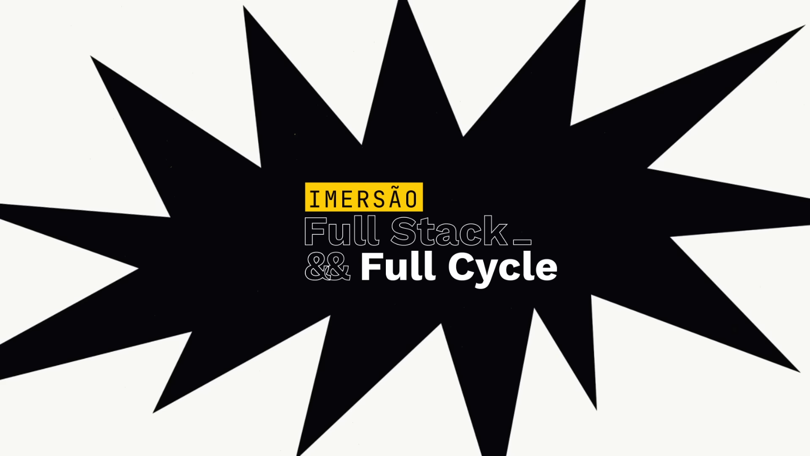
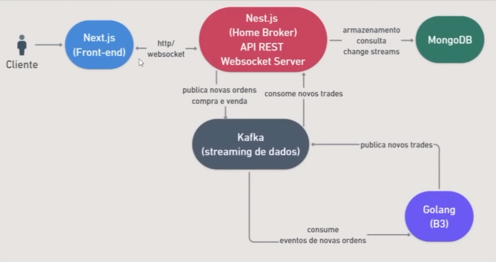
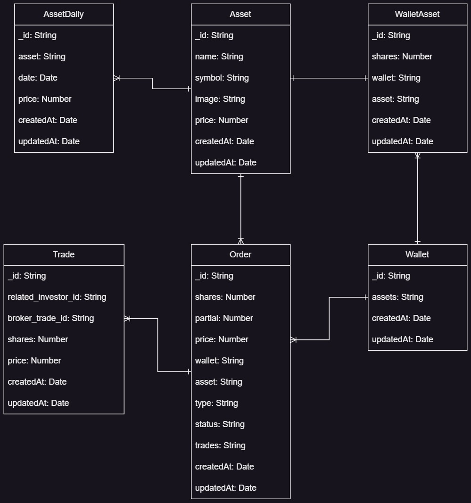
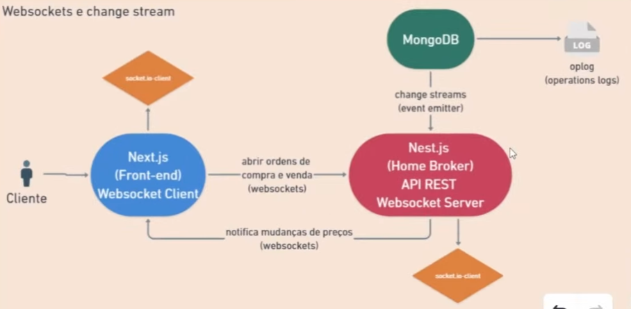

<h1 align="center">Home Broker</h1>

<p align="center">
  
</p>

## Project

A Home Broker with real-time updates and that uses a B3 simulator.

## Features

- Real-time chart update with Web Socket;
- Processing of buy and sell orders with Go;
- Architecture using microservices;

## Technologies/Libraries/Environment

General:

- Windows 10 Home | 22H2
- [Visual Studio Code | 1.98.2](https://code.visualstudio.com/)
- [Insomnia | 10.3.1](https://insomnia.rest/)
- [Postman | 11.34.5](https://www.postman.com/)
- NPM | 10.2.4
- Docker | 26.0.2
- Docker Compose | 2.26.1
- Git | 2.34.1

Back-end (API):

- [Node.JS | 20.18.3](https://nodejs.org/en)
- Nest.JS | 11.10.4
- TypeScript
- Mongoose (MongoDB Connection)
- Websocket | Socket.IO
- Kafka Connection

Database:

- MongoDB | 8.0.3

Front-end (Web application):

- [Node.JS | 20.18.3](https://nodejs.org/en)
- Next.JS
- TypeScript
- Kafka Connection
- Websocket | Socket.IO

B3 Simulator:

- Go | 1.24.1
- Kafka Connection

Queue:

- Apache Kafka

## Architecture

<p align="center">
  
</p>

## Database

<p align="center">
  
</p>

## Websockets and Change Stream

<p align="center">
  
</p>

## How to run

### Apache Kafka

1. Go to the repository folder;
2. Go to the project folder:
```bash
  cd go
```
3. Run the command below to create and launch the container with Kafka:
```bash
  docker-compose up
```

### Go

1. Go to the repository folder;
2. Go to the project folder:
```bash
  cd go
```
3. Run the command below to start the project in Go:
```bash
  go run cmd/main/main.go
```

### Database

1. Go to the repository folder:
2. Run the command below to start the container with the Mongo database:
```bash
  docker-compose up
```

### Back-end (API)

1. Go to the repository folder;
2. Go to the project folder:
```bash
  cd nestjs-api
```
3. Run the command below to install the project dependencies:
```bash
  cd npm install
```
4. Run the command below to launch the API:
```bash
  npm run start:dev
```

### Images Server

1. Go to the repository folder;
2. Go to the project folder:
```bash
  cd nestjs-api
```
3. Run the command below to start the image server:
```bash
  npm run asset-images
```

### Back-end (API) - Consumer Kafka

1. Go to the repository folder;
2. Go to the project folder:
```bash
  cd nestjs-api
```
3. Run the command below to launch the Kafka consumer in the API:
```bash
  npm run consumer
```

### Front-end (Web Application)

1. Go to the repository folder;
2. Go to the project folder:
```bash
  cd next-frontend
```
3. Run the command below to launch the web application:
```bash
  npm run dev
```

### Data Generator for the Database

1. Go to the repository folder;
2. Go to the project folder:
```bash
  cd nestjs-api
```
3. Run the command below to start the data-generating application:
```bash
  npm run command simulate-assets-price
```

## Improvements

- request validation;
- validation with websockets;
- authentication in the API and in next.js;
- user event driven to update the balance;
- separate the order completion from the asset balance update;
- create event socket to update the asset balance in the wallet;
- create a notification in next.js + websocket to show when an order was executed;
- create a balance in reais for the wallet;
- use server-side cache to query assets and orders with fixed price after trading hours;
- prevent sending notifications if there are no customers;
- prevent users not belonging to the orders from subscribing to the websocket notifications for that order;
- reprocessing of order completion in case of failure;
- if it is a sale, check if the balance is sufficient;
- tests;

## License

This project is under the MIT license. See the [LICENSE](LICENSE.md) file for more details.